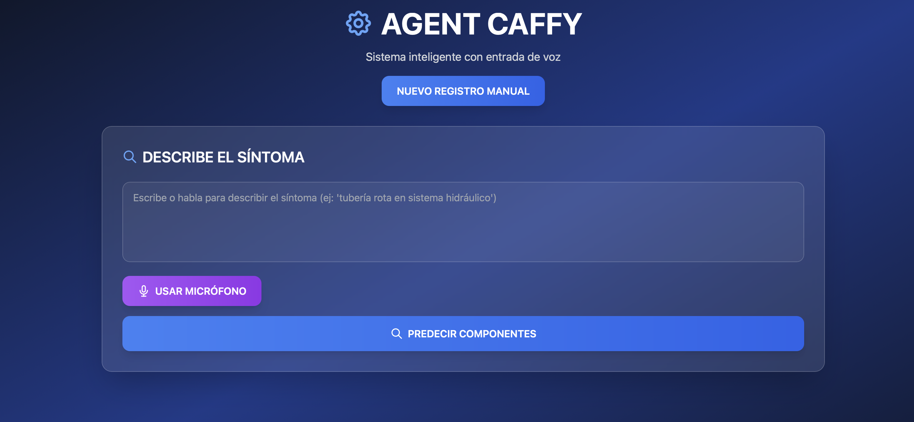

# 🏆 Hackathon Kearney – Winning Project

This repository contains the code developed for the **X Hackathon of the Cátedra de Industria Conectada**, organized by **Universidad Pontificia Comillas (ICAI)** in collaboration with **Kearney** and **CAF**, where this project achieved **✨ 1st Place (Winners)**.

The solution integrates a lightweight backend with multiple APIs and a user-friendly web interface to visualize and interact with the system in real time. It helps train operators to quickly identify and resolve the issues they are assigned.".

## Team Members
- Claudia Agromayor Lammert
- Daniel Aguilera Irala
- Gorka Beltrán de Guevara Puelles
- Sofía Pedrós Tobaruela
- Francisco Javier Ríos Montes
- Manuel Rodríguez Villegas

---

## 🚀 Requirements

- Python 3.9+
- Modern web browser (Chrome, Firefox, Edge, Safari)

---

## ▶️ How to Run

> Run everything **from the root directory** of the project.

Open **two separate terminals** and run:

```bash
# Terminal 1 – Main backend application
python -m backend.app
```

```bash
# Terminal 2 – Repair API
python -m backend.repair_api
```

Keep both terminals running — the APIs must stay active for the frontend to work.

### 🌐 Launch the Frontend

Once the backend services are running, open this file in your browser:

```
frontend/index.html
```

Optional: If you prefer running the frontend via a local server:

```bash
# (Optional) from inside the frontend folder
python -m http.server 8000
# then open http://localhost:8000 in your browser
```

---

## 📂 Project Structure

```plaintext
hackathon_kearney/
│
├── backend/
│   ├── __init__.py
│   ├── app.py              # Main backend API (run: python -m backend.app)
│   ├── repair_api.py       # Repair service API (run: python -m backend.repair_api)
│   └── ...                 # Additional backend modules
│
├── frontend/
│   ├── index.html          # Main web application interface
│   ├── styles.css          # Frontend styling
│   ├── script.js           # Frontend logic
│   └── assets/             # Frontend assets (images, icons, etc.)
│
├── src/                    # Source files or modules (shared code, utilities, etc.)
│   └── ...                 # Project-specific source code
│
├── website.png             # Screenshot of the running web app
├── .gitignore
└── README.md
```

---

## 🖼️ Website Preview



---

## 📝 API Endpoints Documentation

This section documents the backend APIs for external integration. Make sure both `backend.app` and `backend.repair_api` are running.

---

### 1️⃣ `backend.app`

| Endpoint | Method | Description | Request Body | Response |
|----------|--------|-------------|--------------|----------|
| `/predict` | POST | Predict top 3 components for a given description | JSON: `{ "description": "<text>" }` | JSON array of predictions: `[{"componentes": str, "probabilidad": float, "embedding": str}, ...]` |
| `/save_register` | POST | Save a repair record to `registros.csv` | JSON: `{ "sintoma": str, "componente": str, "reparacion": str }` | JSON: `{ "status": "success", "ID": <int> }` |

**Example request for `/predict`:**

```python
import requests

response = requests.post(
    "http://localhost:5001/predict",
    json={"description": "The motor overheats after 10 minutes"}
)
print(response.json())
```

---

### 2️⃣ `backend.repair_api`

| Endpoint | Method | Description | Request Body | Response |
|----------|--------|-------------|--------------|----------|
| `/rank_repairs` | POST | Rank repairs for predicted components | JSON: `{ "component_predictions": [...], "selected_component": "<str, optional>" }` | JSON array of ranked repairs: `[{"component": str, "repair": str, "score": float, ...}, ...]` |

**Request Body Details:**

- `component_predictions`: Output from `backend.app` `/predict` endpoint
- `selected_component`: Optional, filter to a specific component

**Example request for `/rank_repairs`:**

```python
import requests

component_predictions = [
    {"componentes": "Motor", "probabilidad": 0.85, "embedding": "..."},
    {"componentes": "Sensor", "probabilidad": 0.10, "embedding": "..."}
]

response = requests.post(
    "http://localhost:5002/rank_repairs",
    json={
        "component_predictions": component_predictions,
        "selected_component": "Motor"
    }
)
print(response.json())
```

---

### Notes

- `backend.app` runs on **port 5001**, `backend.repair_api` runs on **port 5002** by default.  
- All endpoints return JSON responses.  
- Ensure that embeddings from `/predict` are properly parsed before sending to `/rank_repairs`.  
- The `/rank_repairs` endpoint can return up to 10 top-ranked repairs per component.

---

## 🏅 Acknowledgements

Special thanks to:

- **Universidad Pontificia Comillas – ICAI**
- **Cátedra de Industria Conectada**
- **Kearney & CAF** for organizing the event and providing the challenge
- Mentors, organizers, and all hackathon participants
